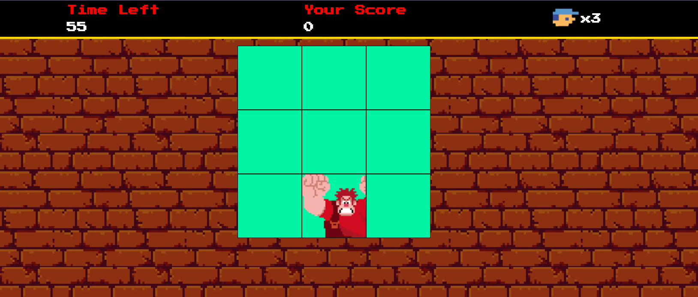

<h1 align="center">Detona Ralph Game</h1>

  
  

  <a href="#-projeto">Projeto</a>&nbsp;&nbsp;&nbsp;|&nbsp;&nbsp;&nbsp;
  <a href="#-tecnologias">Tecnologias</a>&nbsp;&nbsp;&nbsp;|&nbsp;&nbsp;&nbsp;
  <a href="#-jogar">Jogar</a>
  

  

## 🌱 Projeto

- Desafio de projeto da [Dio](https://web.dio.me/)

Criação de um jogo com um sistema de pontuação:
- Acompanhe sua pontuação à medida que progride no jogo e desafie seus amigos a superá-la, clique no quadrado que o Ralph se encontre

- Neste repositório, você encontrará um jogo divertido baseado no famoso filme "Detona Ralph". Este projeto não apenas oferece entretenimento, mas também demonstra várias técnicas avançadas de desenvolvimento de jogos em JavaScript.

## ✨ Tecnologias

- HTML5 e CSS3 para a estrutura e aparência do jogo.
- JavaScript para a lógica de programação e interatividade.
- Sprites e imagens customizadas para criar a estética única do universo de Detona Ralph.

## 🚀 Jogar

- Clone este repositório para sua máquina local.
- Abra o arquivo index.html em seu navegador web.
